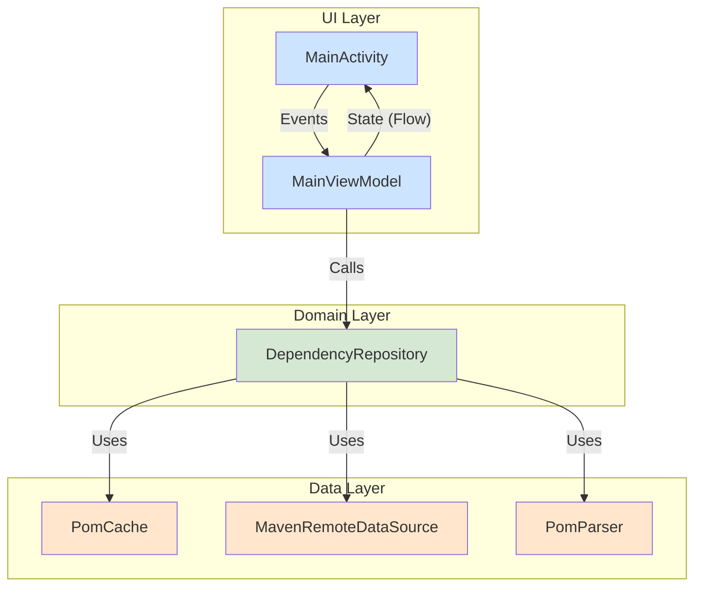

# DESIGN.md: Maven Dependency Tracker

## 1\. 概要

本ドキュメントは、Maven Dependency Tracker アプリケーションの内部設計を定義する。設計は、保守性・拡張性・テスト容易性を高めるため、**SOLID原則**と**MVVMアーキテクチャ**を基本とする。

-----

## 2\. アーキテクチャ

UIの描画ロジックとビジネスロジックを分離するため、階層型アーキテクチャを採用する。



  - **UI Layer (`ViewModel`, `Activity`):** UIの状態管理と描画に責任を持つ。
  - **Domain Layer (`Repository`):** 依存関係解決のビジネスロジック全体を統括する。
  - **Data Layer (`DataSource`, `Parser`, `Cache`):** データの取得、解析、キャッシュに特化する。

-----

## 3\. モジュール（クラス）設計

### 3.1. UI Layer

  - **`MainActivity.kt`**
      - **責任範囲:**
          - UIコンポーネント（入力欄、ボタン、プログレスバー、結果リスト）のレイアウトと操作。
          - `MainViewModel` の `UiState` を監視し、リアルタイムにUIを更新する。
          - 検索中は入力欄と検索ボタンを非活性化し、プログレスバーと中断ボタンを表示する。
          - 検索ボタンのクリックや中断ボタンのクリックといったユーザーイベントを `ViewModel` に通知する。
  - **`MainViewModel.kt`**
      - **責任範囲:**
          - UIの状態 (`UiState`) を `StateFlow` として公開する。
          - 検索ロジックを実行するコルーチンジョブを管理し、中断要求に応じてキャンセルする。
          - `DependencyRepository` を呼び出し、結果を `Flow` として受け取る。
          - 受け取った依存関係を `UiState` のリストに順次追加していく。
          - 入力値の検証や、エラー発生時のメッセージを生成し `UiState` を更新する。
      - **データクラス `UiState`:**
        ```kotlin
        data class UiState(
            val isResolving: Boolean = false, // 検索中か否か
            val resolvedDependencies: List<String> = emptyList(),
            val error: String? = null
        )
        ```
      - **エラーメッセージ例:**
          - `"入力形式が正しくありません (例: group:artifact:version)"`
          - `"POMファイルの取得に失敗しました: (URL)"`
          - `"POMファイルの解析に失敗しました: (ライブラリ座標)"`
          - `"必須情報 (groupId, artifactId, version) が見つかりませんでした: (ライブラリ座標)"`

### 3.2. Domain Layer

  - **`DependencyRepository.kt` (Interface) / `DependencyRepositoryImpl.kt` (Implementation)**
      - **責任範囲:**
          - 依存関係解決のコアロジックを実装する。
          - 指定されたライブラリ座標を最初の結果として含め、推移的依存関係を再帰的に解決する。
          - 依存関係を一つ解決するごとに、結果を `Flow` としてリアルタイムに通知する。
          - **プロパティ解決:** 親POMを再帰的に遡り、複数階層にわたるプロパティ (`${...}`) を解決する。
          - `scope` が `test` `provided`、または `optional` が `true` の依存を除外する。
          - 解決済みのライブラリを管理し、循環参照を防止する。
      - **実装方針:**
          - `fun resolveDependencies(coordinate: String): Flow<String>` を公開する。
          - 内部で `PomCache` を参照し、キャッシュがあればネットワークアクセスをスキップする。
          - `MavenRemoteDataSource` でPOMを取得し、`PomParser` で解析する。
          - 解析に成功したPOMデータは `PomCache` に保存する。

### 3.3. Data Layer

  - **`PomCache.kt`**

      - **責任範囲:**
          - 一度解析に成功したPOMのデータ (`PomData`) をメモリ上にキャッシュする。
          - キー（ライブラリ座標）と値（`PomData`）でデータを保持・提供する。
      - **実装方針:**
          - DI (Dependency Injection) を通じてシングルトンインスタンスとして提供する。
          - 内部で `ConcurrentHashMap<String, PomData>` を保持し、スレッドセーフを確保する。

  - **`MavenRemoteDataSource.kt`**

      - **責任範囲:**
          - ライブラリ座標からPOMファイルのURLを生成し、HTTP GETリクエストでXML文字列を取得する。
          - リクエスト失敗時に1秒間隔で1回リトライする。
      - **実装方針:**
          - HTTPクライアントに **Ktor** を使用。`Result` 型で成功/失敗を返す `suspend` 関数を実装する。

  - **`PomParser.kt`**

      - **責任範囲:**
          - POMのXML文字列を解析し、後続処理で必要な情報（基本情報、親、依存、プロパティ等）を抽出した `PomData` オブジェクトを生成する。
      - **実装方針:**
          - Android標準の `XmlPullParser` を使用し、軽量なパーサーを実装する。

-----

## 4\. データフロー (検索実行時)

1.  **User:** ライブラリ座標を入力し、検索ボタンをタップ。
2.  **`MainActivity`:** `viewModel.startResolution(coordinate)` を呼び出す。
3.  **`MainViewModel`:**
      - `UiState` を `isResolving = true` に更新。これによりUIが検索中表示に切り替わる。
      - `viewModelScope` で `repository.resolveDependencies(coordinate)` の `Flow` を収集 (`collect`) 開始。
4.  **`DependencyRepository`:**
      - (1) 入力された座標を最初のデータとして `Flow` に `emit` する。
      - (2) `PomCache` にデータがないか確認。あればそれを利用、なければ `MavenRemoteDataSource` にPOM取得を依頼。
      - (3) `PomParser` でXMLを解析。成功すれば `PomCache` に保存。
      - (4) 解決すべき新たな依存関係が見つかれば、(2)からの処理を再帰的に繰り返す。依存関係が見つかるたびに `Flow` に `emit` する。
5.  **`MainViewModel`:**
      - `Flow` から依存関係が `emit` されるたびに、`UiState` の `resolvedDependencies` リストに追加して更新する。
6.  **`MainActivity`:**
      - `UiState` の変化を監視しており、リストが更新されるたびに画面の表示を更新する。
7.  **Flow完了/中断時:**
      - `ViewModel` は `onCompletion` または `catch` ブロックで `UiState` を `isResolving = false` に更新。UIが通常状態に戻る。

-----

## 5\. 使用ライブラリ

| ライブラリ                                   | 目的                                       |
| -------------------------------------------- | ------------------------------------------ |
| `androidx.lifecycle:lifecycle-*`           | `ViewModel`, `lifecycleScope` の利用         |
| `org.jetbrains.kotlinx:kotlinx-coroutines-*` | 非同期処理、`Flow` の実現                    |
| `io.ktor:ktor-client-*`                      | ネットワーク通信 (HTTP GET) とリトライ機能 |
| **(テスト用)** |                                            |
| `org.junit.jupiter:junit-jupiter-*`          | 単体テストフレームワーク (JUnit 5)           |
| `io.mockk:mockk`                             | 依存オブジェクトのモック化                 |
| `app.cash.turbine:turbine`                   | `Flow` のテストを容易にする                  |
| `io.ktor:ktor-client-mock`                   | Ktor Client のHTTPリクエストをモック化      |
| `org.jacoco:org.jacoco.core`                 | テストカバレッジ計測                       |
